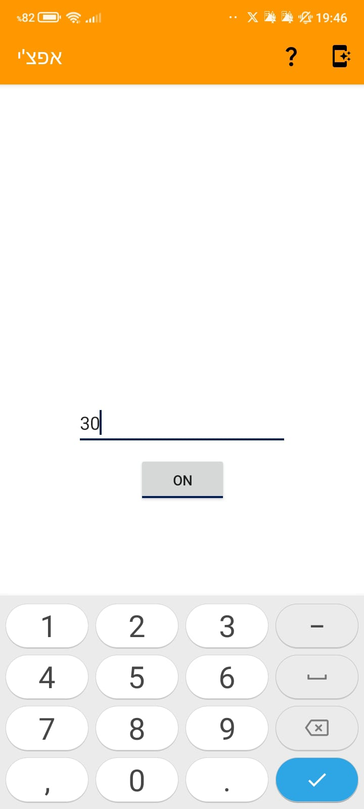

# AppChi

AppChi is a multi tools app developed by Eyt Lev.

**Note! This version of the app (AppChi 2.x) is not longer maintained!**

**Newer versions is under [here](https://github.com/Eyt-Lev/AppChi_new/)** (probably private repo now)**.**

## Download

From Google Play (**Note! Google Play has the latest version which is probably not 2.0.1**)

Or [APK](6.apk) Latest version (**Of AppChi 2!**) v2.0.1.

## Features

AppChi has many features in three categories:

* Productivity
* Tools
* Fun

### Productivity

In the Productivity segment AppChi has 2 major tools:

##### Tasks Manger (Your Tasks)

The tasks manager lets you create schedule categorize and complete tasks.

##### Languages Learn Helper (Languages Quiz)

This tool allow you to create your own sets of words to practice and it can quiz you with:

* Yes or no questions
* Multiple choice questions
* Hearing questions
* Spelling questions

### Tools

AppChi has 6 different tools:

##### BMI Calculator

The BMI calculator lets you calculate your BMI and view your BMI category.

##### WhatsApp Direct Message

The WhatsApp direct message tool allows you to send a message over WhatsApp without saving the number.

##### Flashlight

AppChi lets you turn on and off your flashlight rapidly with your set interval.

##### Metronome

With this tool you can use a metronome within AppChi.

##### Random Numbers Calculator

Random numbers calculator lets you generate a random number or password to your liking.

##### Microphone

AppChi can be used as a microphone, allowing you to record and instantly hear from your speaker.
Specially useful with an external speaker.

### Fun

The fun category has only 2 tools/games, Jokes Generator and Hallel Triangle.

## Languages Support

AppChi support both **English** and **Hebrew**.

## Screenshots

Home screen (Tabbed):

Home screen (United):

Settings screen:

Main screen drawer:

Tasks screen:

Languages screen:

Random screen:

Metronome:

BMI calculator:

Microphone:

Flashlight:

WhatsApp direct message:

